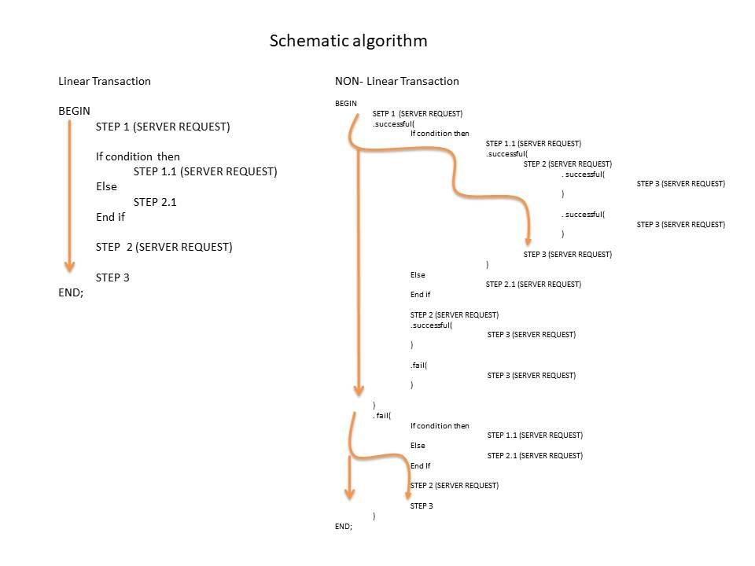

# JS-TRANSACTION-BLOCK
 Linear Transaction refers to Execute Execute a block of instructions within the same thread, including requests to a remote server (XMLHttpRequest).
 
# The Big Picture
In more than one occasion we have encountered the need to request information from the remote server, either lookup or for validation purposes. If, for any reason within the same transaction concept, more than one call to the server was required, we entered into an Asynchronous dilemma.


# Possible Solution
```html
<!DOCTYPE html>
<html>
<head lang="en">
    <meta charset="UTF-8">
    <title></title>
</head>
<script src="https://ajax.googleapis.com/ajax/libs/jquery/3.3.1/jquery.min.js"></script>

<script>
    /* Linear Transactions

     BEGIN -- Linear Transactions
         STEP 1  (SERVER REQUEST)

         If condition then
            STEP 1.1 (SERVER REQUEST)
         Else
            STEP 1.2 (SERVER REQUEST)
         End if

         STEP 2 (SERVER REQUEST)

         STEP 3 Output or return anything
     END; -- Linear Transactions

     */

    /*  Compatibility
     *  "await" ECMAScript 2018 (ECMA-262) status "Standard"
     *  please check here for compatibility with "await" support
     *  https://developer.mozilla.org/en-US/docs/Web/JavaScript/Reference/Operators/await
     */
    function makeServerSyncCall(url) {
        return new Promise(
            resolve => {
                $.ajax({
                    url: url,
                    success: function(result){
                        resolve(result);
                    }
                    ,error: function(result){
                        resolve(result);
                }
            })
        });
    }

    /*
     Using the Schematic Algorithm.
     */
    //  BEGIN BLOCK
    console.log('BEFORE START BLOCK');
    let x = (async function() {
        try {
            // BEGIN
            console.log('BEGIN Linear Transaction (SYNC) BLOCK');

            // STEP1  (SERVER REQUEST)
            console.log("STEP 1  (SERVER REQUEST) Sleep by  10 seconds ('./remote_php_wait_for_n_seconds.php')");
            var p = await
            makeServerSyncCall('./remote_php_wait_for_n_seconds.php?secs=10');
            console.log(p);

            for (i = 0; i < 20; i++) {
                console.log("STEPS INSIDE BLOCK " + i);
            }
            // If condition then
            if (2 == 1) {
                // STEP1.1 (SERVER REQUEST)
                console.log("STEP 1.1  (SERVER REQUEST) Sleep by  2 seconds ('./remote_php_wait_for_n_seconds.php')");
                var p = await
                makeServerSyncCall('./remote_php_wait_for_n_seconds.php?secs=2');
                console.log(p);
                //Else
            } else {
                // STEP1.2 (SERVER REQUEST)
                console.log("STEP 1.2  (SERVER REQUEST) Sleep by  3 seconds ('./remote_php_wait_for_n_seconds.php')");
                var p = await
                makeServerSyncCall('./remote_php_wait_for_n_seconds.php?secs=3');
                console.log(p);
            }
            //STEP2 (SERVER REQUEST)
            console.log("STEP 2  (SERVER REQUEST) Sleep by  5 seconds ('./remote_php_wait_for_n_seconds.php')");
            var p = await
            makeServerSyncCall('./remote_php_wait_for_n_seconds.php?secs=5');
            console.log(p);

            //STEP3 Output or return anything
            console.log("STEP 3  Output or return anything");
            console.log('END BLOCK');
        } catch(e){
            console.log('Error Exception not managed', e);
        }
        console.log('END Linear Transaction (SYNC) BLOCK');
    })();
    //  BEGIN BLOCK
    console.log('AFTER BLOCK STARTED');

</script>
<body>

</body>
</html>
```

